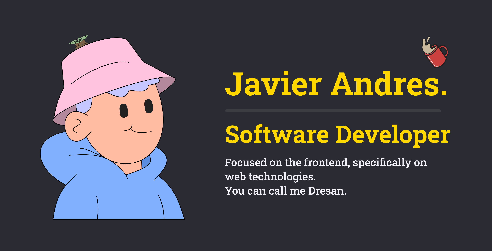

</img>

### 🌌&nbsp; Sobre mí

&nbsp;&nbsp;&nbsp;🧑‍💻 &nbsp;Actualmente estoy libre para desarrollar proyectos.\
&nbsp;&nbsp;&nbsp;🌱 &nbsp;Me encantan los computadores y la innovacion.\
&nbsp;&nbsp;&nbsp;💓 &nbsp;Me apasionan las tecnologias para el desarrollo de software.\
&nbsp;&nbsp;&nbsp;✍️ &nbsp;Me gusta aprender sobre: Arquitectura de software, Backend, Tecnologias emergentes etc.\
&nbsp;&nbsp;&nbsp;🛠️ &nbsp;Desarrollando desde hace 3 años y los que faltan🫡.\
&nbsp;&nbsp;&nbsp;👨‍👩‍👧‍👧 &nbsp;Vivo en colombia, soy gran fan de los videojuegos y el cine.

  &nbsp;&nbsp;&nbsp;&nbsp;
  &nbsp;&nbsp;&nbsp;&nbsp;
  &nbsp;&nbsp;&nbsp;&nbsp;

  
<b>💻 &nbsp;Stack principal</b>

   

&nbsp;
&nbsp;
&nbsp;
&nbsp;
&nbsp;
&nbsp;
&nbsp;
 &nbsp;
 &nbsp;
 &nbsp;
 &nbsp;
 &nbsp;
&nbsp;
&nbsp;
&nbsp;

  
<b>🧠 &nbsp;Otras tecnologias, aprendizaje constante</b>

   

&nbsp;
&nbsp;
&nbsp;

  
<b>⚙️ &nbsp;Estadisticas de GitHub</b>

   
    

    
    

    

      
      
    

